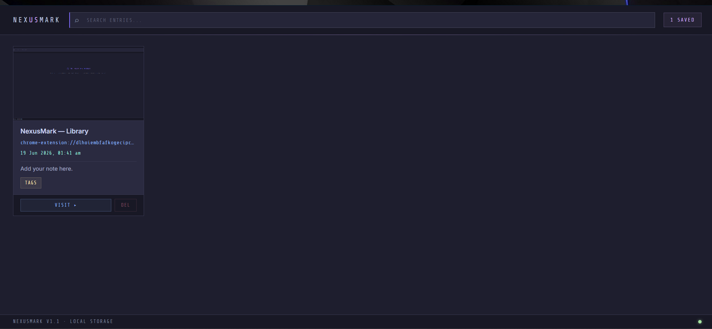

<div align="center">


# NexusMark

**A minimal, keyboard-first Chrome extension for capturing and annotating webpage screenshots.**

[](https://developer.chrome.com/docs/extensions/mv3/)
[](https://github.com/kkrishna-31/nexusmark/releases)
[](LICENSE)
[](CONTRIBUTING.md)

<br/>

> Capture any webpage in one keystroke. Add a note, tag it, browse your library — all without leaving Chrome.

<br/>



</div>

---

## ✦ Features

| Feature | Description |
|---|---|
| **Manual Capture** | Click the extension icon → hit **Capture Now** to screenshot the active tab |
| **Hotkey Capture** | Press `Ctrl+Shift+S` (or `Cmd+Shift+S` on Mac) from any page |
| **Custom Hotkey** | Reassign the shortcut from the popup — opens Chrome's shortcut settings directly |
| **Annotate** | Add a title, note, and comma-separated tags before saving |
| **Library** | Browse all saved captures in a searchable card grid |
| **Screenshot Preview** | Click any card thumbnail in the library to open a full-resolution lightbox |
| **Search** | Filter entries instantly by title, URL, note, or tags |
| **Save Folder** | Set a custom subfolder name within your Downloads directory |
| **Local Storage** | Everything is stored on-device via `chrome.storage.local` — no servers, no accounts |

---

## ⌨ Keyboard Shortcut

| Action | Windows / Linux | macOS |
|---|---|---|
| Capture current tab | `Ctrl + Shift + S` | `Cmd + Shift + S` |

To change the shortcut: open the extension popup → click **SET HOTKEY**, or go to `chrome://extensions/shortcuts` directly.

---

## ⬇️ Direct Download

<a href="https://github.com/kkrishna-31/NexusMark/releases/latest/download">
  
</a>

> **No build step needed.** Just download, unzip, and load in Chrome.

## 🚀 Installation

### From source (Developer Mode)

1. Clone or download this repository:
   ```bash
   git clone https://github.com/kkrishna-31/nexusmark.git
   ```

2. Open Chrome and navigate to:
   ```
   chrome://extensions
   ```

3. Enable **Developer Mode** (toggle in the top-right corner).

4. Click **Load unpacked** and select the `nexusmark/` folder.

5. The NexusMark icon will appear in your Chrome toolbar. Pin it for quick access.

> **Note:** The extension is not on the Chrome Web Store yet. Loading unpacked requires Developer Mode to remain enabled.

---

## 📁 Project Structure

```
nexusmark/
├── manifest.json           # Extension manifest (MV3)
├── background.js           # Service worker — handles hotkey capture
│
├── popup/
│   ├── popup.html          # Home screen (shown when clicking toolbar icon)
│   ├── popup.js            # Home screen logic — capture, hotkey, folder, library
│   ├── popup.css           # Shared styles for popup and capture views
│   ├── capture.html        # Annotate & save screen (opened after capture)
│   └── capture.js          # Capture view logic — save entry, discard
│
├── library/
│   ├── library.html        # Library full-page view
│   ├── library.js          # Render grid, search, preview modal, delete
│   └── library.css         # Catppuccin-themed library styles
│
├── utils/
│   ├── capture.js          # captureTab() — screenshots active tab
│   └── storage.js          # getAllEntries / saveEntry / deleteEntry
│
└── icons/
    ├── icon16.png
    ├── icon48.png
    └── icon128.png
```

---

## 🎨 Design

NexusMark uses a custom dark UI theme inspired by **Catppuccin Mocha** and **VS Code Dark+**.

- **Font:** [Share Tech Mono](https://fonts.google.com/specimen/Share+Tech+Mono) (labels/mono) + [Inter](https://fonts.google.com/specimen/Inter) (body)
- **Background:** `#1e1e2e` warm deep purple
- **Accent:** Lavender `#cba6f7` / Blue `#89b4fa` / Teal `#94e2d5` / Yellow `#f9e2af`
- All text colors are chosen for WCAG AA contrast on dark backgrounds

---

## 🔒 Permissions

| Permission | Why it's needed |
|---|---|
| `activeTab` | Access the currently active tab to capture its screenshot |
| `tabs` | Read tab URL and title metadata |
| `scripting` | Inject capture logic into the active page when needed |
| `storage` | Save and retrieve all entries locally via `chrome.storage.local` |
| `downloads` | Reserved for future export/download features |
| `host_permissions: <all_urls>` | Required to capture screenshots on any website |

NexusMark **does not** make any network requests. All data lives in your browser's local storage.

---

## 🛠 Tech Stack

- **Chrome Extension Manifest V3**
- Vanilla JavaScript (ES Modules) — no frameworks, no build step
- `chrome.storage.local` for persistence
- `chrome.tabs.captureVisibleTab` for screenshots
- `chrome.commands` API for keyboard shortcut
- Pure CSS with custom properties

---

## 🗺 Roadmap

- [ ] Export library as JSON backup
- [ ] Import / restore from backup
- [ ] Download individual screenshots as PNG
- [ ] Sort library by date / title / tags
- [ ] Tag filter sidebar in library
- [ ] Firefox support (MV3 compatible)

---

## 🤝 Contributing

Contributions, bug reports, and feature requests are welcome!

1. Fork the repo
2. Create a branch: `git checkout -b feature/your-feature`
3. Commit your changes: `git commit -m 'feat: add your feature'`
4. Push and open a Pull Request

Please read [CONTRIBUTING.md](CONTRIBUTING.md) before submitting.

---

## 📄 License

Distributed under the MIT License. See [LICENSE](LICENSE) for details.

---

<div align="center">

Made with focus and dark themes &nbsp;·&nbsp; NexusMark v1.1.0

</div>
